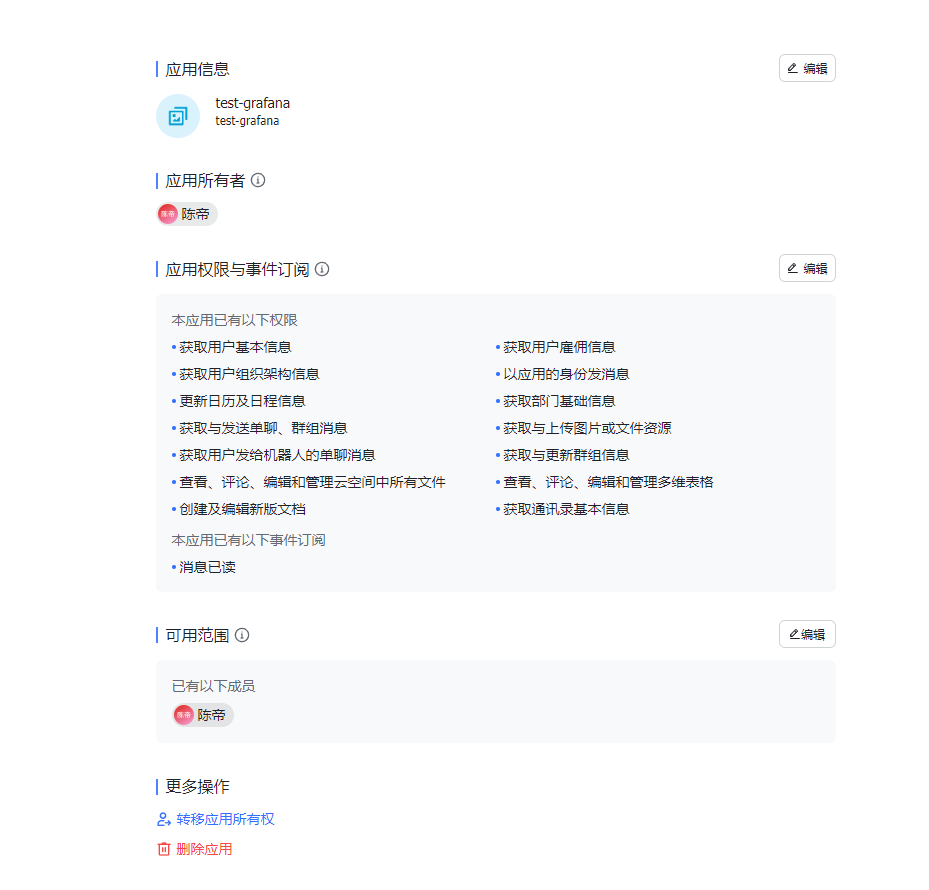

https://www.feishu.cn/flow/api/trigger-webhook/87084648bd0fdcc37dd27010a5056ce0

# 机器人秘钥

[飞书开放平台 (feishu.cn)](https://open.feishu.cn/app/cli_a57ed2d4bdbad00d/baseinfo)

cli_a57ed2d4bdbad00d

UMmihe4SNe8mxlyQS1PBUgn86JpNIyv8

# 应用机器人

https://www.feishu.cn/flow/api/trigger-webhook/c971612d24f91c50f322d332b3b034c9

# 群机器人

https://open.feishu.cn/open-apis/bot/v2/hook/e1cc37ad-d760-4c4d-9f73-e9346f0a0314

# 自定义机器人和应用机器人

# 应用管理

[飞书机器人助手 (feishu.cn)](https://botbuilder.feishu.cn/app/builder/appmanage?appId=7346617635645177860&&appOpenId=cli_a57ed1cc3fe9d00b)

https://www.feishu.cn/flow/api/trigger-webhook/c971612d24f91c50f322d332b3b034c9

