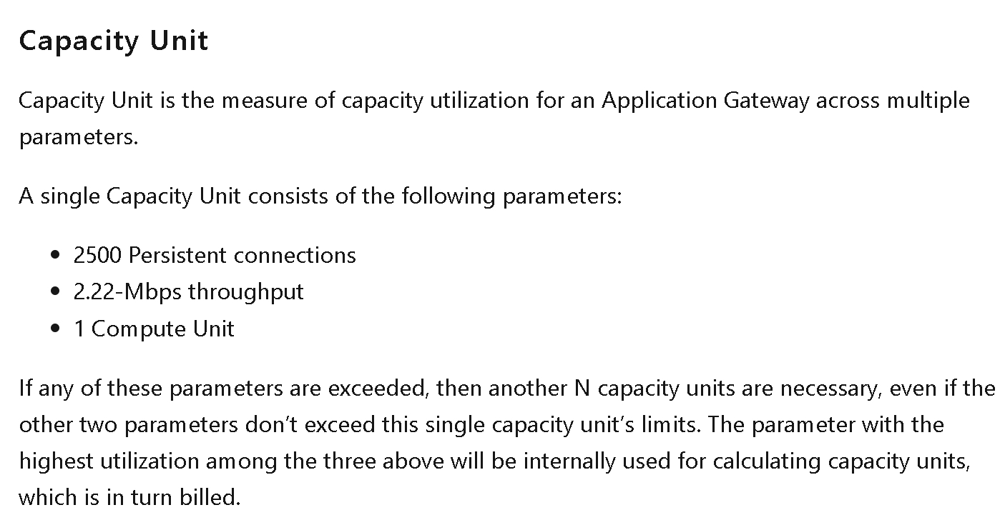
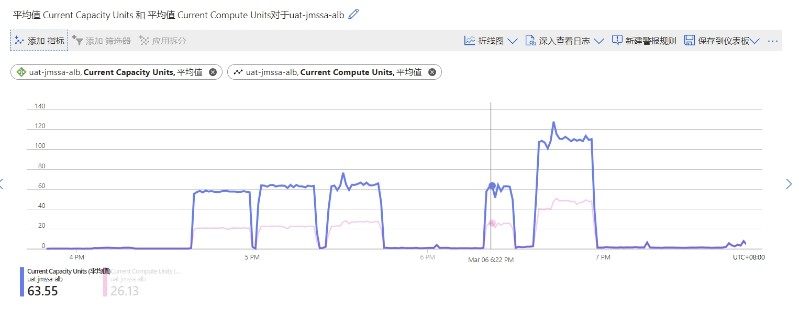
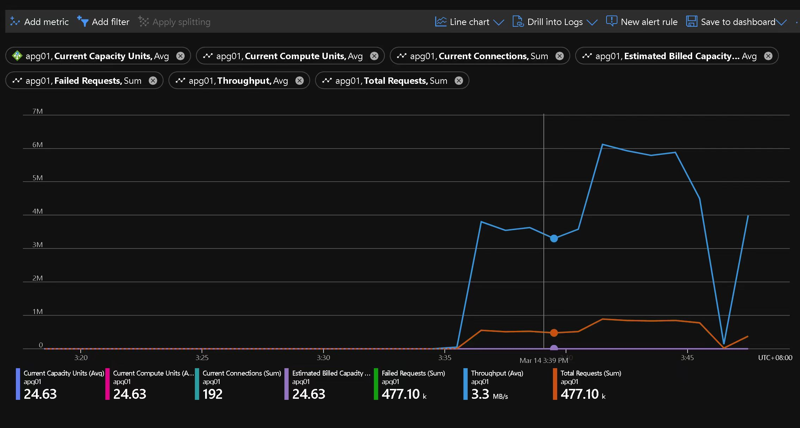

# 设置合理的AppGW告警机制

## 基于我们之前对AppGW scaling机制的讨论

参考如下官方文档，如果其中任何一个因素（Compute Unit or Throughput or Connections）超过了上图显示的阈值。那么Capacity Unit会随之增加。
如果Capacity Unit每超过10，那么Instance会增加一个。

## 分析客户的测试

无论是在AutoScale/Manual 形式下，若instance数量设置小于2，App GW默认会有2个instance keep running状态。若收到请求，AG会开始处理流量。
AutoScale的机制，是根据流量大小决定的。假设当前instance数量为2，若是遇到traffic突然激增到很大，预估需要5个instance才能处理，那么新增的3台VM会同时Scale out。如果流量慢慢增加，Scale out的次数会出现多次。在Scale out发生期间，访问AG会出现白屏，高延迟的问题，直到Scale-out结束。若数据量降低，AG也会自动Scale in到合适的instance数量，这个阶段AG访问不受影响。

根据极兔的测试，高延迟已经出现，但是instance并没有scaling出来。

​	真的没有scaling出来吗？如果默认就是2台，应该一直就有2台ready在那里才对，但是我们看客户的表，当客户manual拉到2的时候，流量可以看到上来了，说明latency虽然大，但是current CU确实没有提升：

## CSA测做的测试

为了验证这个结论：

可以看到35分开始，弹出的机器是41分机器，弹出来之后CU马上升上去（这里说的弹出来是可以开始接流量了）

官网提到一个instance 只是10CU，我们通过单台压测发现1KB的Request 请求单台最多7-8k/s, 这个时候APG就达到瓶颈，而且CU能达到40左右

如果做吞吐压测基本达到底层网络指标，而且CU更高能达到2百多

> 需要注意>10个CU能达到多少产品是没SLA的

## 建议的告警参数

### 从连接数考虑

Current Connections - The number of active connections: reading, writing, or waiting. The count of current connections established with Application Gateway.

这个无法设置一个特别solid的告警数值

如果我们知道当前的底层isntance数量，自然可以直接做一个数学公式：isntanceCount * currentConnections = 动态变化的上限值 * 75% = 合理的现存连接数告警

但是我们不知道isntance count这个数量

New Connections per second - The average number of connections handled per second during that minute.

一秒新增500个？ 是不是这样就需要注意了？（或许可以更小）

1秒新增500个，1个instance有10个cu，说明2500*10/500=50秒就能达到一个扩容的标准

假如人工反应到手动扩容的时间是15分钟，

如果设置1秒100个，那就是250秒会触发扩容，加上人工反应的时间

### 从吞吐量考虑

Throughput - The rate of data flow (inBytes+ outBytes) during that minute.

1个instance的上限是22.2Mbps

=======
由于无法知道底层istance的数量，这个数值依然不是做告警的好的数值

### 从延迟考虑

延迟比较好，当延迟明显增大的时候，设置告警，并认为直接操作是最合理的建议

选择Application Gateway total time作为优先的告警选择，一旦大于一个值，说明就该考虑手动scaling了

>>>>>>> d3f269eac0cf67cdda96a47342d2f7055619e85e

<<<<<<< HEAD
# 我建议可以这样设置告警

比如兔兔设置的instance上限设置的是100，下限设置的是50，那么：

1. Current Capacity Unit -  Count of processor capacity consumed. Factors affecting compute unit are TLS connections/sec, URL Rewrite computations, and WAF rule processing. 
   1. 设置3个告警；
   2. 第一个告警设置为Current Capacity Unit数量为501，代表CU数量超出了文档标准的baseline（1instance=10CU），可能会开始触发scaling，这种情况用于提示极兔运维团队超出baseline的规定，scaling随时可能会发生；
   3. 第二个告警设置为Current Capacity Unit数量为800（我采用了80%这个比例，1000*80%），首先这种情况有一定概率instance已经开始scaling（如我前面说的，因为我们测试下来有的instance甚至能出来100+的CU），所以作为一个指标放在这里作为80%的水位线；
   4. 第三个告警设置为Current Capacity Unit数量为1000，因为这种情况可能就是当前100这个上限能弹出来的最多的instance了，虽然大概率还有可能有额外的CU能撑住，但是已经弹不出新的instance了，这种时候运维一定要参与，手动调整instance数量。
2. New connections per second - The average number of new TCP connections per second established from clients to the Application Gateway and from the Application Gateway to the backend members. 
   1. 设置3个告警：
   2. 和上面同理，第一个告警为2500*10*50 = 1,250,000，是下限baseline
   3. 第二个告警为2500*10*100*80%=2,000,000，是80%的水位线
   4. 第三个告警为2500*10*100=2,500,000，是上限baseline，同时也是到达了必须运维参与手动调整instance的阶段了
3. Throughput：
   1. 同上设置3个告警
   2. 第一个告警为2.22Mbps*10*50=1110 Mbps，作为下限baseline
   3. 第二个告警为2.22Mbps*10*100*80%=1776 Mbps，作为80%水位线
   4. 第三个告警为2.22Mbps*10*100=2,220 Mbps，作为上限baseline，同时也是到达了必须运维参与手动调整instance的阶段了

只有这三组参数和scaling instance相关，所以综合考虑，利用上下限来分别设置告警可能最合适